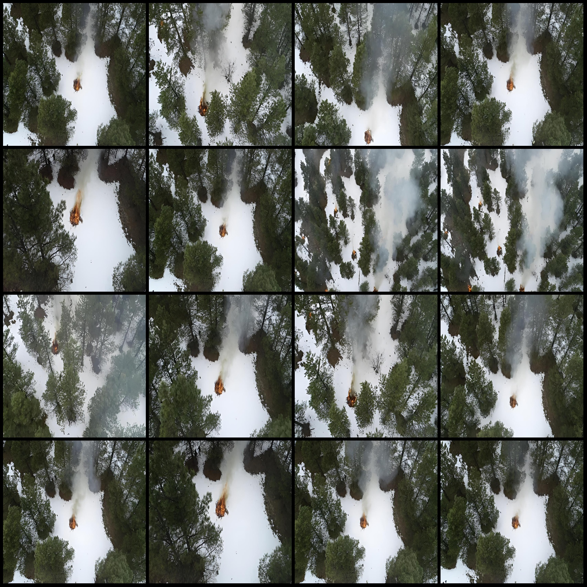
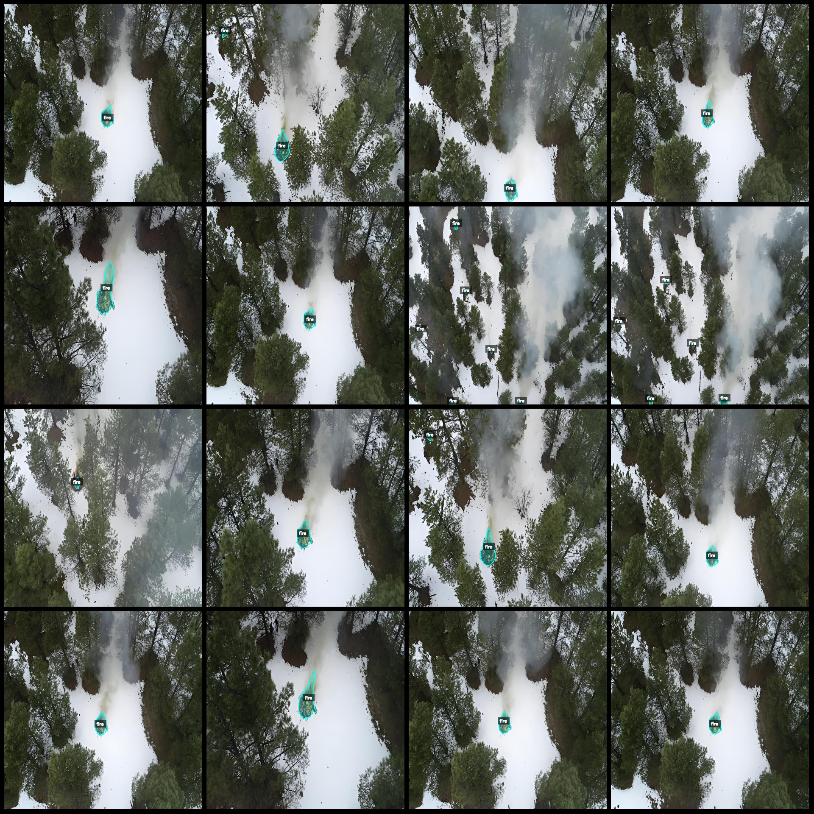
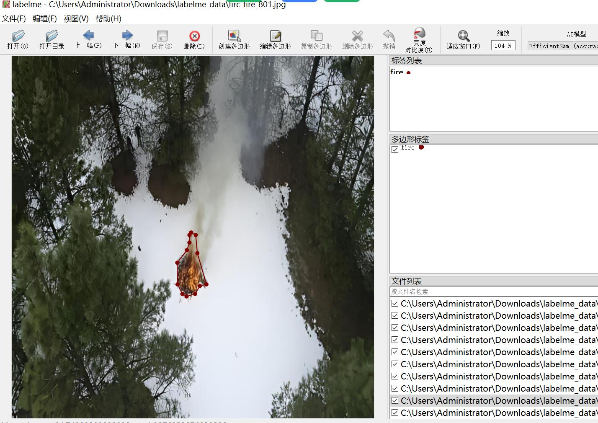

# Drone Viewpoint Aerial Photo Firespotting and Segmentation Dataset in LabelMe Format with 1519 Images

## Data Format: LabelMe Format (Without mask files, only containing JPG images and corresponding JSON files)

### Image Count:
Number of JPG files: 1519

### Annotation Count:
Number of JSON files: 1519

### Number of Annotation Categories: 1

#### Annotation Category Name: "fire"

Each category has a number of bounding boxes:
- fire count = 2354
- Total bounding boxes: 2354

### Annotation Tool: LabelMe v.5.5.0

### Image Resolution: 832x832

#### Annotation Rules: Polygons are drawn around the categories.

#### Importance Note: The dataset can be edited using LabelMe, but the JSON dataset needs to be converted into Mask, Yolo, or Coco format for semantic segmentation or instance segmentation.

#### Special Notice: The accuracy of the trained model or weight files is not guaranteed by this dataset.

### Image Preview:

#### Example of Annotation:

#### Randomly selected 16 images for demonstration:

#### Example of Annotation drawing results:

#### Example of an Edited LabelMe image:

## Images

Here is a pay link on Stripe ( https://buy.stripe.com/3cs8yP7sY87d0vu9AB ). Please contact me lonlonago@foxmail.com after funding $89, and I will send you a complete data files , thank you!

